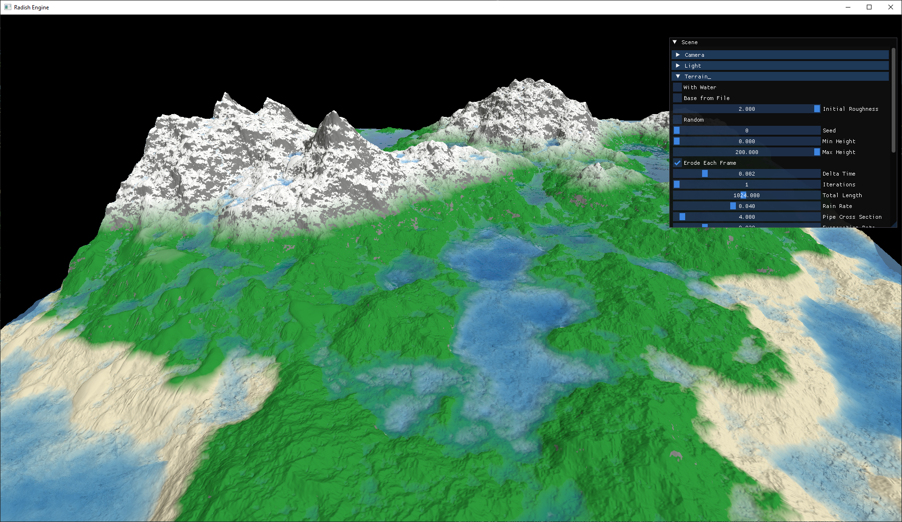
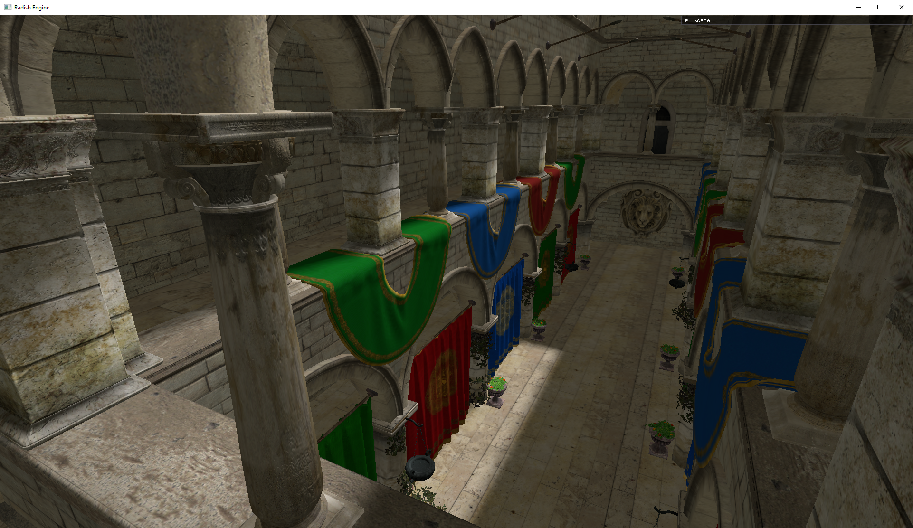

# Radish Engine

Radish Engine is a DirectX12 renderer & mini engine for experimenting with renderer architecture, rendering techniques and mainly focusing on procedural generation.

# Screenshots


<p align="center">
<sub><i>Rendering of Terrain generated with erosion & Water simulation as a byproduct of Hydraulic Erosion rendered with Screen Space Reflections/Refractions</i></sub>
</p>

<br/>


<p align="center">
<sub><i>Rendering of Sponza with shadow mapping</i></sub>
</p>

# Features

## Graphics

- Water Rendering
- Screen Space Rendering & Reflections
- Blinn Phong Lighting Model
- Normal Mapping
- Shadow Mapping

## Procedural Generation

- Real-Time Terrain Generation & Erosion:
  - GPU Hydraulic Erosion
  - GPU Thermal Erosion
  - Diamond Square
## Engine 

- Fully Bindless Architecture with SM 6.6
- Runtime Shader Compilation
- Entity Component System Architecture with [EnTT](https://github.com/skypjack/entt)
- Obj & Texture Loading with [tinyobjloader](https://github.com/tinyobjloader/tinyobjloader) and [stb_image](https://github.com/nothings/stb)
- MipMap Generation with [FidelityFX SPD](https://github.com/GPUOpen-Effects/FidelityFX-SPD)
- [Dear ImGui](https://github.com/ocornut/imgui) Integration

# Build

Make sure to have pre-requisites installed & submodules initialized

- [CMake 3.24](https://cmake.org/download/)
- [Visual Studio 2022](https://visualstudio.microsoft.com/downloads/)

``bash
git submodule update --init --recursive
```

Generate Visual Studio solution files with CMake & build the project

```bash
cmake -S . -B Build -G "Visual Studio 17 2022" -A x64
cmake --build Build --config RelWithDebInfo
```

## Controls

| Key | |
| :--: | :-- |
| **WASD+Ctrl+Space** | Camera movement |
| **E** | Toggle Capture Cursor |
| **M** | Reset Terrain Generation |
| **R** | Reset Camera Position |
| **L** | Move Light to Camera |
| **Tab** | Toggle between Camera/Light View |

# References

- Jákó, B., & Tóth, B. (2011). Fast Hydraulic and Thermal Erosion on GPU. Eurographics.

- X. Mei, P. Decaudin and B. -G. Hu, "Fast Hydraulic Erosion Simulation and Visualization on GPU," 15th Pacific Conference on Computer Graphics and Applications (PG'07), Maui, HI, USA, 2007, pp. 47-56, doi: 10.1109/PG.2007.15.